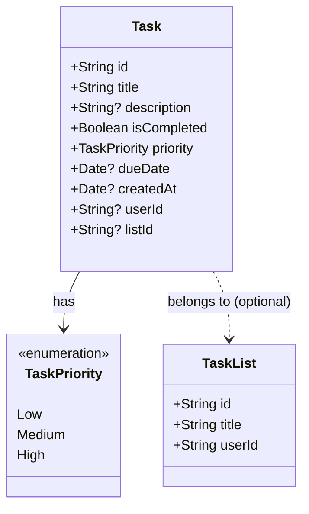

# Data Model Diagram

This diagram represents the core data model for the MakeItSo application, shared across iOS and Android platforms via Firebase Firestore.

## Entity Relationship Diagram

## Description

The data model consists of `Task` and `TaskList` entities, along with a `TaskPriority` enumeration.

- **Task**: Represents a single to-do item.
  - `id`: The Firestore document ID.
  - `title`: The title of the task.
  - `description`: An optional detailed description.
  - `isCompleted`: A flag indicating if the task is finished.
  - `priority`: The level of importance (Low, Medium, High).
  - `dueDate`: An optional deadline.
  - `createdAt`: The timestamp when the task was created (Server side).
  - `userId`: The ID of the user who owns the task.
  - `listId`: An optional reference to a `TaskList` ID.
- **TaskList**: Represents a collection of tasks.
  - `id`: The Firestore document ID.
  - `title`: The title of the list.
  - `userId`: The ID of the user who owns the list.
- **TaskPriority**: An enumeration used to categorize tasks by priority.
