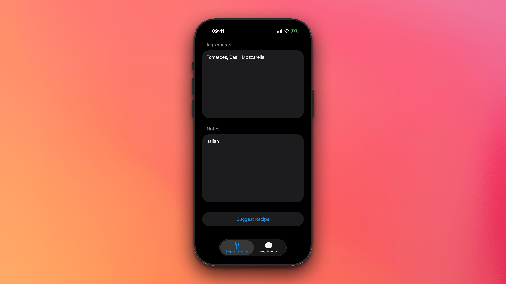

# FriendlyMeals – Firebase Fundamentals iOS Samples

Welcome to **FriendlyMeals**, a sample iOS project accompanying the [Firebase Fundamentals video series](https://www.youtube.com/playlist?list=PLl-K7zZEsYLnfwBe4WgEw9ao0J0N1LYDR) on YouTube.


*FriendlyMeals app – Hero screenshot with gradient background*

This repository demonstrates how to integrate Firebase features into an iOS app, with a current focus on **Firebase AI Logic**. As the video series progresses, we will add more examples covering additional Firebase services and best practices for iOS development.

## 📺 Video Series

- [Firebase Fundamentals on YouTube](https://www.youtube.com/playlist?list=PLl-K7zZEsYLnfwBe4WgEw9ao0J0N1LYDR)

## 🚀 Features

- **Firebase AI Logic**: Learn how to use Firebase's AI-powered features to enhance your app's functionality.
- **Modular Structure**: The project is organized by feature, making it easy to follow along and extend.
- **Upcoming**: More Firebase features (such as Authentication, Firestore, Storage, and more) will be added soon!

## 🏗️ Project Structure

```
FriendlyMeals/
  └── FriendlyMeals/
      └── Features/
          ├── MealPlannerChat/
          └── SuggestRecipe/
```

## 🛠️ Getting Started

1. **Clone this repository**
   ```sh
   git clone <repo-url>
   ```
2. **Open the project**
   - Open `FriendlyMeals.xcodeproj` in Xcode.

## 🔥 Setting Up Firebase

1. **Create a Firebase Project**
   - Go to the [Firebase Console](https://console.firebase.google.com/).
   - Click **Add project** and follow the prompts.

2. **Register the iOS App**
   - Click **Add app** > **iOS**.
   - Enter the bundle ID: `com.google.firebase.samples.FriendlyMeals`
   - (Optional) Enter an app nickname and App Store ID.
   - Click **Register app**.

3. **Download the `GoogleService-Info.plist`**
   - Download from Firebase Console.
   - Add to `FriendlyMeals/FriendlyMeals` in Xcode (select 'Copy items if needed').

4. **Firebase SDKs**
   - The project uses Swift Package Manager. Firebase dependencies are already included.

5. **Run the App**
   - Build and run in Xcode on a simulator or device.

## 🤝 Contributing

Contributions and suggestions are welcome! Feel free to open issues or pull requests as you follow along with the series.

## 📄 License

This project is licensed under the [Apache License](./LICENSE), which can be found in the root of this repository. It is provided for educational purposes as part of the Firebase Fundamentals video series.
